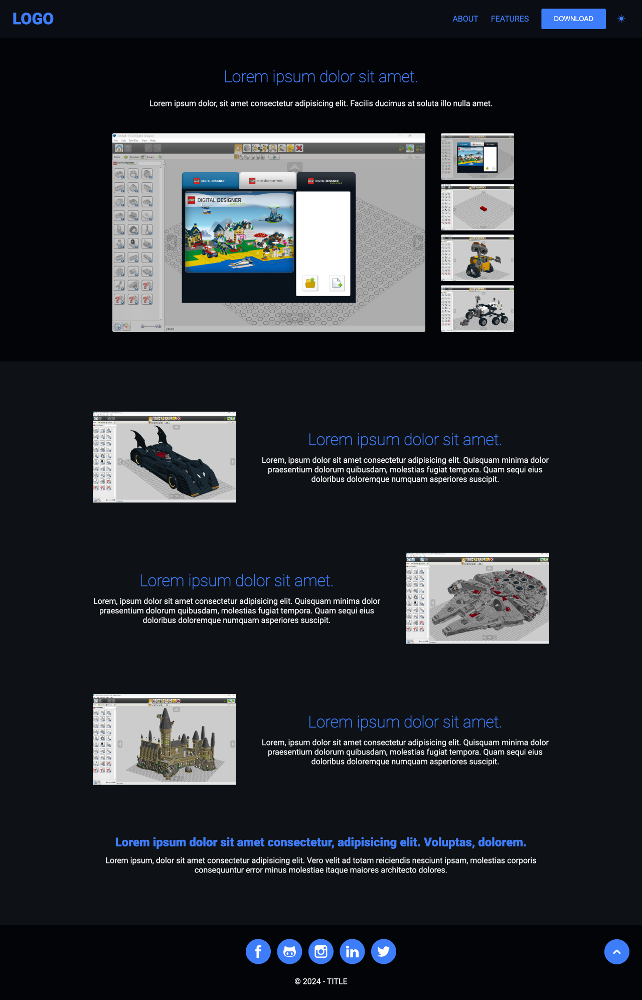
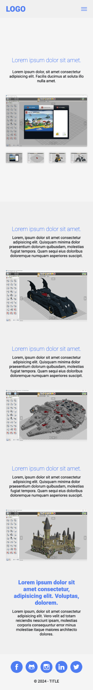

# Basic Landing Page Template

## Description

This project started with an idea from <a href="https://github.com/Eonvorax">Eonvorax</a>, a peer from Holberton School. He wanted a simple way to build a landing page without relying on complex templates. We worked together to design a basic and user-friendly page for one of his projects, focusing on the essentials.

## Objectives

- Develop a simple, easy-to-use landing page template based on a minimalist idea.
- Build the project using only HTML, CSS, and a bit of JavaScript.
- Ensure the design is responsive and adapts well to all devices.
- Make the template easy to customize (logo, titles, text, colors).
- Keep the code clean and well-organized for easy maintenance.
- Offer a minimalist and beginner-friendly solution for personal or small projects.
- Encourage others to reuse and adapt the template freely.

## Tech Stack


## File Description

| **FILE**     | **DESCRIPTION**                                     |
| :----------: | --------------------------------------------------- |
| `assets`     | Contains the resources required for the repository. |
| `index.html` | Main HTML structure for the project.                |
| `style.css`  | Styles and animations for the project.              |
| `script.js`  | Behavior script for interactivity.                  |
| `README.md`  | The README file you are currently reading 😉.       |

## Installation & Usage

### Installation

1. Clone this repository:
    - Open your preferred Terminal.
    - Navigate to the directory where you want to clone the repository.
    - Run the following command:

```
git clone https://github.com/fchavonet/web-basic_landing_page_template.git
```

2. Open the cloned repository.

### Usage

1. Open the `index.html` file in your browser.

2. Customize the page title and logo:
    - In the `<head>` section, change the content inside `<title>`:

    ```
    <title>My Awesome Project</title>
    ```

    - Also change the logo text inside the `<header>`:

    ```
    <h1><a href="#">MY AWESOME PROJECT</a></h1>
    ```

3. Edit the content:
    - You can modify titles (inside `<h3>` or `<h4>` tags) and text content (inside `<p>` tags) to fit your project.

    ```
    <h3 class="hidden-left">Your new title here</h3>
    <p class="hidden-right">Your custom description here.</p>
    ```

4. Update social media links:
    - At the bottom of the `index.html` file (in the `<footer>`), edit the `href` attributes inside each social link.

    ```
    <a class="social-icon" href="YOURGITHUBLINKHERE.com" target="_blank">
        
    </a>
    ```

5. Customize the colors:
    - Open the `style.css` file and scroll to the `:root` section at the top.
    - Adjust these variables to match your brand’s color palette. This will automatically update all major color elements across the site.

    ```
    :root {
        --primary-color: rgb(62.5, 125, 250);
        --secondary-color: rgb(50, 100, 200);
        --primary-dark-color: rgb(2, 4, 9);
        --secondary-dark-color: rgb(14, 17, 22);
        --primary-light-color: rgb(245, 245, 245);
        --secondary-light-color: rgb(240, 240, 240);
    }
    ````

6. Change the images:
    - Replace the existing images in the folder `./assets/images/screenshots` with your own.
    - Keep the same file names to avoid breaking image links.

> For gallery images, try to preserve the original proportions to maintain the layout.

7. Open the `index.html` file in your web browser to see your modifications.

8. Deploy your page:
    - You can host it for free using GitHub Pages:
        - Push your code to a GitHub repository.
        - Go to the repository `Settings > Pages`, set the source to main branch and save..
        - Your site will be live at https://your-username.github.io/repo-name.

You can also test the project online by clicking [here](https://fchavonet.github.io/full_stack-basic_landing_page_template/).

<table>
    <tr>
        <th align="center" style="text-align: center;">Desktop view</th>
        <th align="center" style="text-align: center;">Mobile view</th>
    </tr>
    <tr valign="top">
        <td align="center">
            <picture>
                <source media="(prefers-color-scheme: dark)" srcset="./assets/images/screenshots/desktop_page_screenshot-dark.webp">
                <source media="(prefers-color-scheme: light)" srcset="./assets/images/screenshots/desktop_page_screenshot-light.webp">
                
            </picture>
        </td>
        <td align="center">
            <picture>
                <source media="(prefers-color-scheme: dark)" srcset="./assets/images/screenshots/mobile_page_screenshot-dark.webp">
                <source media="(prefers-color-scheme: light)" srcset="./assets/images/screenshots/mobile_page_screenshot-light.webp">
                
            </picture>
        </td>
    </tr>
</table>

## What's Next?

- Add essential SEO tags to improve search engine visibility.
- Replace the custom animation system with the [Animate On Scroll (AOS)](https://michalsnik.github.io/aos/) library for smoother and more efficient animations, especially on mobile devices.
- Create a JSON configuration file to manage editable page content (logo, titles, texts, etc.) more easily.

## Thanks

- A big thank you to my friends Pierre and Yoann, always available to test and provide feedback on my projects.

## Author(s)

**Fabien CHAVONET**
- GitHub: [@fchavonet](https://github.com/fchavonet)
